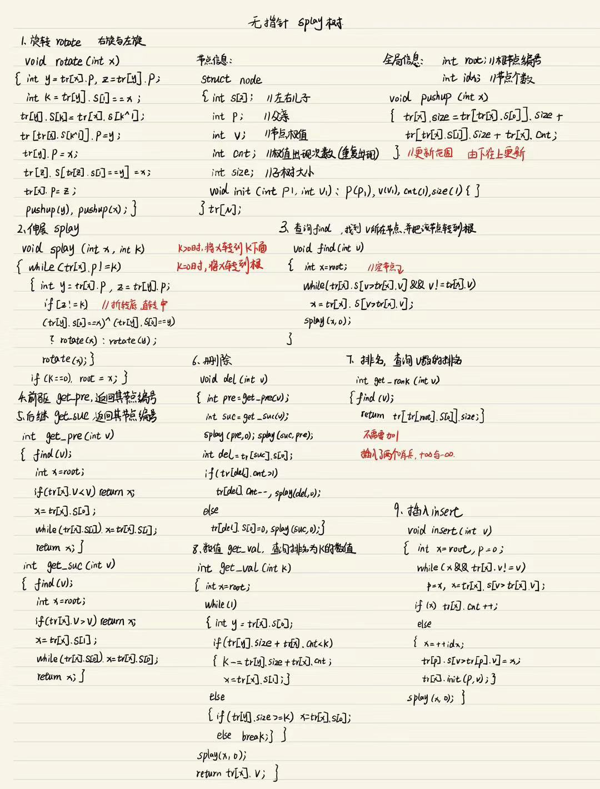

# Lab4 BBST实验报告
## 一、功能简介
1. 插入  
   实现了将x插入B-树中
2. 删除  
   实现了将x从B-树中删去
3. 查询  
   实现了两种查询要求
   * 查询x的排名
   * 查询排名为x的数
4. 求前驱  
   实现了求x的前驱(定义为小于x的最大数)
5. 求后继  
   实现了求x的后继(定义为大于x的最小数)
6. 区间翻转
   实现了使用splay树实现区间翻转操作。
## 二、具体实验方式与测试样例
### 插入
1. B-树插入
   * 实现方式  
     为在B-树中插入一个新的关键码e，首先调用**search(e)** 在树中查找该关键码。查找过程必然终止于某一外部节点v，且其父节点由变量_hot指示。当然，此时的_hot必然指向某一叶节点（可能同时也是根节点）。接下来，在该节点中再次查找目标关键码e，可以确定e在其中的正确插入位置r。最后，只需将e插至这一位置。至此，_hot所指的节点中增加了一个关键码。若该节点内关键码的总数依然合法，则插入操作随即完成。否则，该节点发生了一次上溢，此时需要调用**solveOverflow(_hot)**，使该节点以及整树重新满足B-树的条件。
2. 红黑树插入
* 代码
~~~c++
   template <typename T> BinNodePosi(T) RedBlack<T>::insert(const T& e) 
   { 
    BinNodePosi(T) & x = search(e); if (x) return x;
    x = new BinNode<T>(e, _hot, NULL, NULL, -1); _size++;
    solveDoubleRed(x); return x;
   }
    template <typename T> void RedBlack<T>::solveDoubleRed(BinNodePosi(T) x) 
   {
  //如果递归到根
  if (IsRoot(*x))
  { 
    _root->color = RB_BLACK; _root->height++; return; 
  }
  BinNodePosi(T) p = x->parent; if (IsBlack(p)) return;
  BinNodePosi(T) g = p->parent;
  BinNodePosi(T) u = uncle(x);
  if (IsBlack(u)) 
  {
    if (IsLChild(*x) == IsLChild(*p))
    p->color = RB_BLACK;
    else
    x->color = RB_BLACK;
    g->color = RB_RED;
    BinNodePosi(T) gg = g->parent;
    BinNodePosi(T) r = FromParentTo(*g) = rotateAt(x);
    r->parent = gg;
   } 
   else 
   {
     p->color = RB_BLACK; p->height++;
     u->color = RB_BLACK; u->height++;
     if (!IsRoot(*g)) g->color = RB_RED;
     solveDoubleRed(g);
   }
  }
~~~ 
### 删除
1. B-树删除
   * 实现方式  
     为从B-树中删除关键码e，也首先需要调用**search(e)** 查找e所属的节点。倘若查找失败，则说明关键码e尚不存在，删除操作完成；否则目标关键码所在的节点必由返回的位置v指示。此时，通过顺序查找，即可进一步确定e在节点v中的秩r。令e与其直接后继互换位置，即可确保待删除的关键码e所属的节点v是叶节点。接下来可直接将e（及其左侧的外部空节点）从v中删去。如此，节点v中所含的关键码以及（空）分支将分别减少一个。若该节点所含关键码的总数依然合法，则删除操作完成。否则，该节点发生了下溢，需要通过调用**solveUnderflow(v)**，使该节点以及整树重新满足B-树的条件。  
2. 红黑树删除
* 代码
~~~c++
 template <typename T> bool RedBlack<T>::remove(const T& e) 
 {
   BinNodePosi(T) & x = search(e); 
   if (!x) return false;
   BinNodePosi(T) r = removeAt(x, _hot); 
   if (0 >= --_size) return true;
   if (!_hot)
   { 
      _root->color = RB_BLACK; 
      updateHeight(_root); return true; 
   }
   if (BlackHeightUpdated(*(_hot)))
   if (IsRed(r))
   { 
      r->color = RB_BLACK; 
      r->height++; 
      return true; 
   }
   solveDoubleBlack(r); return true;
}
template <typename T> void RedBlack<T>::solveDoubleBlack(BinNodePosi(T) r) 
{
  BinNodePosi(T) p = r ? r->parent : _hot; if (!p) return;
  BinNodePosi(T) s = (r == p->lChild) ? p->rChild : p->lChild;
  if (IsBlack(s)) 
  {
    BinNodePosi(T) t = NULL;
    if (HasLChild(*s) && IsRed(s->lChild)) t = s->lChild;
    else if (HasRChild(*s) && IsRed(s->rChild)) t = s->rChild;
    if (t) 
    {
      RBColor oldColor = p->color;
      BinNodePosi(T) b = FromParentTo(*p) = rotateAt(t);
      if (HasLChild(*b)) b->lChild->color = RB_BLACK; updateHeight(b->lChild);
      if (HasRChild(*b)) b->rChild->color = RB_BLACK; updateHeight(b->rChild);
      b->color = oldColor; updateHeight(b);
    } 
    else 
    { 
      s->color = RB_RED; s->height--;
      if (IsRed(p)) 
      {
         p->color = RB_BLACK;
      } 
      else 
      {
        p->height--;
        solveDoubleBlack(p);
      }
    }
   } 
   else 
   {
     s->color = RB_BLACK; p->color = RB_RED;
     BinNodePosi(T) t = IsLChild(*s) ? s->lChild : s->rChild;
     _hot = p; FromParentTo(*p) = rotateAt(t);
     solveDoubleBlack(r);
   }
}
~~~
### 查询
1. 查询x的排名
   * 实现方式  
     对B-树进行中序遍历，使用vector对遍历到的关键码进行记录，最后按照顺序确定x的顺序即可。
2. 查询排名为x的数
   * 实现方式  
      对B-树进行中序遍历，使用vector对遍历到的关键码进行记录，最后按照顺序确定顺序为第x的数即可。
> 中序遍历的实现代码
~~~c++
void travel(BTNodePosi(int) root)
{
  if(root==NULL)
  {
     return ;
  } 
  int final=root->key.size();
  int i=0;
  for(;i<final;i++)
  {
    travel(root->child[i]);
    cout<<root->key[i]<<endl;
  }
  travel(root->child[i]);
}
~~~
### 求前驱
* 求前驱
  * 实现方式  
     对B-树进行中序遍历，使用vector对遍历到的关键码进行记录，使用自己实现的vector定位到不大于要查找的数，其前一位就是所求的数。
### 求后继
* 求后继
  * 实现方式  
     对B-树进行中序遍历，使用vector对遍历到的关键码进行记录，使用自己实现的vector定位到不大于要查找的数，其后一位就是所求的数。
### 测试样例
> 需要输入 1 来确认需要进行功能一。
* 输入
~~~
10
1 106465
4 1
1 317721
1 460929
1 644985
1 84185
1 89851
6 81968
1 492737
5 493598
~~~
* 输出
~~~
106465
84185
492737
~~~
### 区间翻转
  * 实现方式  
    使用splay树维护权值排序，本题的权值即为编号排序。在反转区间[l,r]的时候，我们可以考虑利用Splay的性质，将l-1翻转至根节点，再将r+1翻转至根节点的右儿子,然后不断地替换子节点的左右子树即可。如果单纯的进行左右翻转，时间复杂度会大大增加，所以引入懒惰标记使得最后清算是否需要翻转，时间复杂度大大减小。
   > 对于splay树，根据资料手写了一遍代码，使得基本理解了用法，具体算法图片里说的很清楚，这里不再赘述。
   
### 测试样例
> 需要输入 2 来确认需要进行功能二。
* 输入
~~~
5 3
1 3
1 3
1 4
~~~
* 输出
~~~
4 3 2 1 5
~~~
## 四、总结
1. 收获
   本次实验巩固了自己对BST的理解，使得概念更加清晰，也弄懂了之前很久都想不明白的问题，受益匪浅。
2. 参考资料
   * 《数据结构(c++语言版)》邓俊辉编著 清华大学出版社
   * [B站《文艺平衡树》算法讲解](https://www.bilibili.com/video/BV1gB4y1e7CT/?spm_id_from=333.337.search-card.all.click&vd_source=ae72203e6bd2550ea00aa8934b8c2fd2)
3. 项目地址  
   本次Lab所有文件已上传至[https://github.com/rucerchui/Sophomore/tree/main/Lab2](https://github.com/rucerchui/Sophomore/tree/main/Lab2)
# 欢迎您的使用!