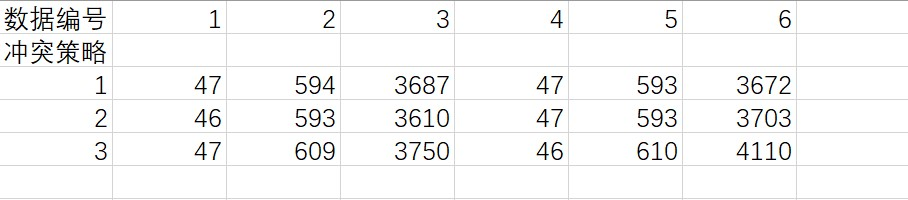
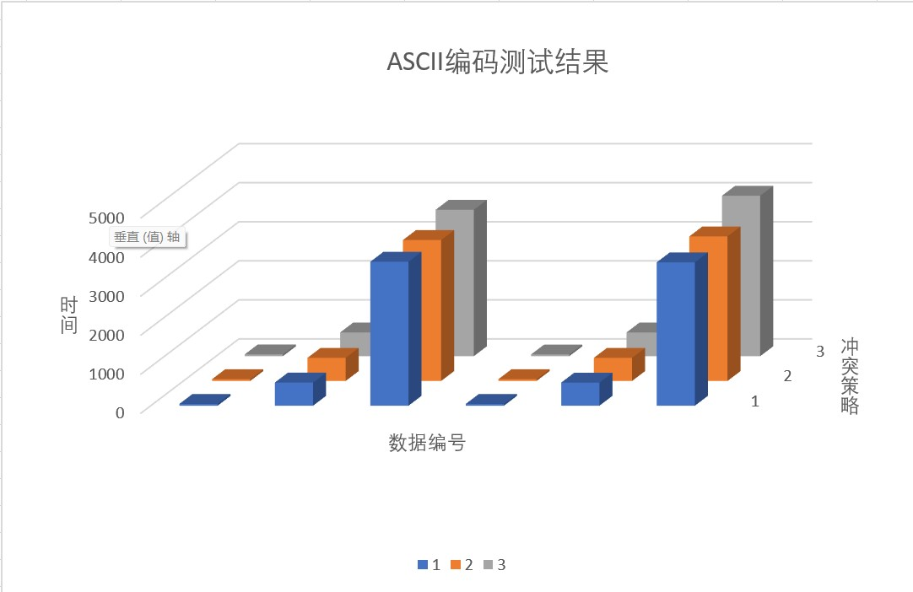
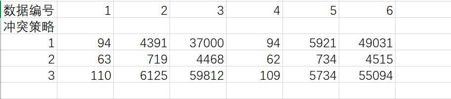
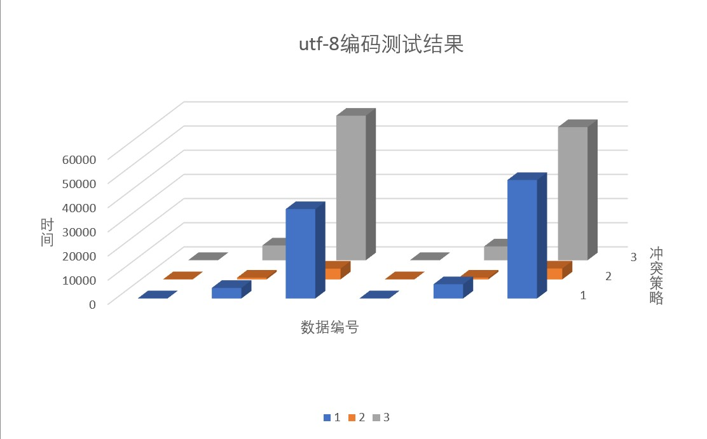

# Lab5 Hash 实验报告
## 测试数据的构造
* 规模  
  数据分为两类，每一类有三组。一类为ASCII编码，取自poj.txt;一类为utf-8编码，取自hdu.txt。第一组数据规模为10000，第二组数据规模为100000，第三组数据规模为500000。  
* 实现方法  
  第一步是根据随机数确定操作类型，如果是0，利用STL中的**vector**与**algorithm**搭配使用可以快速实现**每条映射关系只进行一次插入操作**。如果是1，则第二步是保证了数据具有80%的查询合法性与20%的非法查询，即输出中-1的比例会占到20%。以上每确定一条操作指令与对象后便会计数，直到到达规模为止。  
* 数据特点  
  查询/操作比例接近1:1。插入和查询的分布方式均衡。值得一提的是，当数据规模达到500000时，数据最后的操作均为查询操作，我认为可能的原因时空白数据大大减少，随机数周期优先导致无法进行有效的插入操作。
> 代码
~~~c++
srand((unsigned)time(NULL));
      while(now<10000)
      {
        temp_type=rand()%2;
        if(temp_type==0)
        {
          temp_number=rand()%total_num;
          iter=find(out_data.begin(),out_data.end(),temp_number);
          if(iter!=out_data.end())
          {
             continue;
          }
          out_data.push_back(temp_number);
          outfile<<temp_type<<' '<<data[temp_number].name<<' '<<data[temp_number].number<<endl;
          now++;
        }
        else
        {
           temp_true=rand()%100;
           if(temp_true<81&&out_data.size()>1)
           {
              temp_number=rand()%out_data.size();
              outfile<<temp_type<<' '<<data[out_data[temp_number]].name<<endl;
           }
           else
           {
              temp_number=rand()%total_num;
              outfile<<temp_type<<' '<<data[temp_number].name<<endl;
           }
           now++;
        }
      }
~~~
## 哈希函数实现思路
### ASCII编码
从测试数据中读入数据后，封装到string中传递给hash1函数.该函数会根据每个字符进行加权计算，这里取的权重是3，尽可能避免聚集现象。字符串每一位依次加权，然后对90001取余，得到哈希值。
> hash1代码
~~~c++
int hash1(string data)
{
   int length=data.length();
   int hash=0;
   for(int i=0;i<length;i++)
   {
      hash=(hash*3+(unsigned)data[i])%M;
   }
   return hash;
}
~~~
### utf-8码
从测试数据中读入数据后，封装到string中传递给hash1函数.该函数首先会确定对应的utf编码的字节数，（使用**check**函数，根据**移位**和**与运算**确定），然后使用atoi函数，将对应的字符转化为数字，接着会根据每个数字进行加权计算，这里取的权重是2，因为utf字符串都比较长。字符串每一位依次加权，然后对90001取余，得到哈希值。
> hash2代码
~~~c++
int hash2(string data)
{
   int length=data.length();
   int hash=0;
   int temp_num;
   string temp_data;
   for(int i=0;i<length;i++)
   {
      if((check(data[i]))==1)
      {
        temp_data=data[i];
        temp_num=atoi(temp_data.c_str());
        hash=(hash*2+temp_num)%M;
      }
      else if((check(data[i]))==2)
      {
        temp_data=data[i];temp_data+=data[i+1];
        temp_num=atoi(temp_data.c_str());
        hash=(hash*2+temp_num)%M;
        i=i+1;
      }
      else
      {
        temp_data=data[i];temp_data+=data[i+1];temp_data+=data[i+2];
        temp_num=atoi(temp_data.c_str());
        hash=(hash*2+temp_num)%M;
        i=i+2;
      }
   }
   return hash;
}
~~~
## 冲突策略实现思路
### 链地址法
使用结构体建立节点，使每个节点都可以指向下一个目标所在的位置。当发生冲突时，可以通过独立链进行拓展，从而完成散列表的组装。
~~~c++
void confilct1(int hash_key,Node* data)
{
   if(list[hash_key].node_num==0)
   {
     list[hash_key].begin=data;
     list[hash_key].node_num++;
   }
   else
   {
     Node* temp=list[hash_key].begin;
     while(temp->next!=NULL)
     {
       temp=temp->next;
     }
     temp->next=data;
     list[hash_key].node_num++;
   }
}
~~~
### 双向平方试探法 
以平方数为距离，确定下一试探桶单元，两次为一个周期，分别在冲突值前后进行试探，找到空桶即可结束。
~~~c++
void confilct2(int hash_key,Node* data)
{
  if(list[hash_key].node_num==0)
  {
    list[hash_key].begin=data;
    list[hash_key].node_num++;
  }
  else
  {
     for(int i=1;i<300;i++)
     {
        int temp_try_1;
        int temp_try_2;
        temp_try_1=(hash_key+i*i)%M;
        temp_try_2=(hash_key-i*i)%M;
        if(temp_try_1>=0)
        {
          if(list[temp_try_1].node_num==0)
          {
            list[temp_try_1].begin=data;
            list[temp_try_1].node_num++;
            break;
          }
        }
        if(temp_try_2>=0)
        {
          if(list[temp_try_2].node_num==0)
          {
            list[temp_try_2].begin=data;
            list[temp_try_2].node_num++;
            break;
          }
        }
     }
  }
}
~~~
### 线性试探法
线性距离，单次逐步向前试探，直到找到空桶为止。
~~~c++
void confilct3(int hash_key,Node* data)
{
  if(list[hash_key].node_num==0)
  {
    list[hash_key].begin=data;
    list[hash_key].node_num++;
  }
  else
  {
     for(int i=1;i<M;i++)
     {
        int temp_try_1;
        temp_try_1=(hash_key+i)%M;
        if(list[temp_try_1].node_num==0)
        {
          list[temp_try_1].begin=data;
          list[temp_try_1].node_num++;
          break;
        }
      }
  }
}
~~~
## 测试结果表格
### ASCII编码

### utf-8编码

## 问题解答
### 问题一
在数据规模较小时，差异并不明显，在允许的误差范围内可以视为相等。当数据规模再大一个数量级之后，比ASCII码的速度降慢了一些。还有一个地方，某些字符如果按照ASCII码解释会出现负数，导致段错误，需要加入unsigned进行修正。可能的原因是二者相差并不太大，系统内部也可按照ASCII码解读特殊字符，时间误差可能来自系统内部对utf的转化。
### 问题二
在ASCII码的测试中，链地址法是最快的，其次是双向平方试探，最次是线性试探。对于utf来说，随着数据规模的增大，双向平方试探的速度相比其他两种，效率是惊人的。可能的原因，对于ASCII码来说，冲突的概率比较小，按部就班的排列是最省时省力的操作。对于utf来说，聚集的现象很明显，双向平方可以很好的规避大规模聚集的发生，快速跳出聚集区域，从而规避大量的冲突风险，因此时间是很快的。
### 问题三
字母一般是有内部联系的，不太完美的哈希函数会导致出现聚集现象，使冲突的几率大大增加，导致时间成本的增加。
### 问题四
优先Huffman树可以高效的解决字符串到特定数字映射的问题。对于成体系的单词系统来说，Huffman的效率与准确度是毫无疑问比哈希表更优的。